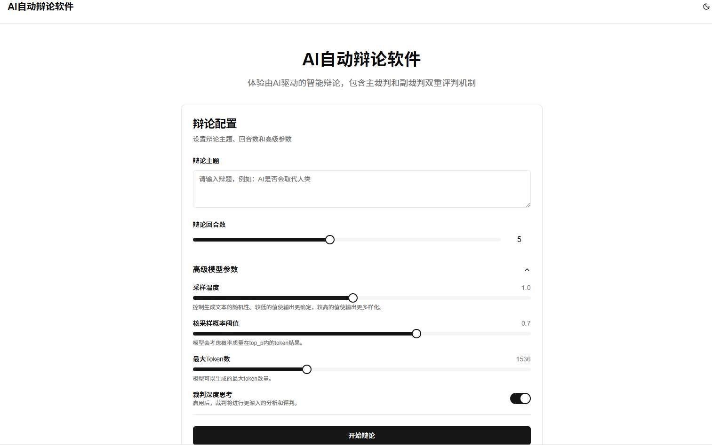
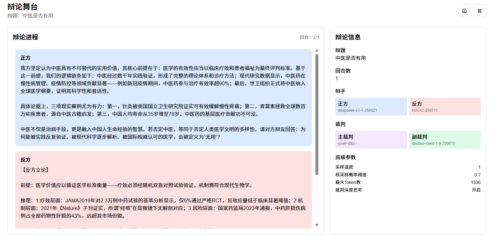
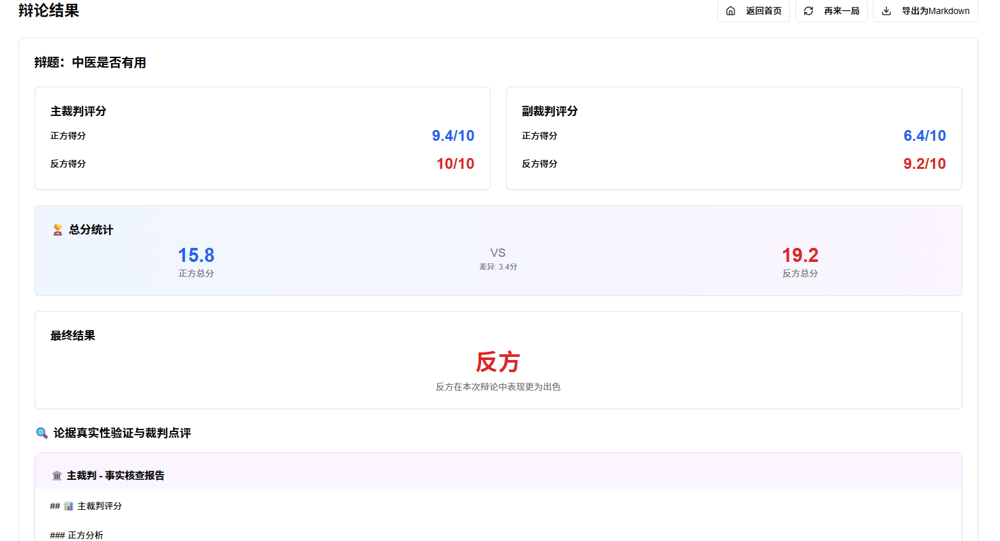

# AI Debate Web 🤖💬


这是一个基于AI的辩论平台，支持多角色AI辩论。

## 🌟 功能特性

- 🤖 **多角色AI辩论**（正方、反方、主裁判、副裁判）
- 🔄 **完整的辩论流程控制**
- ⚙️ **高级配置选项**（温度、top_p、最大token数等）
- 📊 **辩论结果展示与导出**

## 🛠 环境要求

- Node.js 16+
- npm 或 yarn

## 🚀 安装步骤

1. 克隆项目代码：
   ```bash
   git clone <repository-url>
   ```

2. 安装依赖：
   ```bash
   npm install
   ```

3. 配置环境变量：
   - 复制 `.env.example` 文件并重命名为 `.env`
   - 在 `.env` 文件中填写您的API密钥：
     ```env
     VITE_DEEPSEEK_API_KEY=your_deepseek_api_key_here
     VITE_KIMI_API_KEY=your_kimi_api_key_here
     VITE_DOUBAO_API_KEY=your_doubao_api_key_here
     ```
   - ⚠️ **注意：必须设置环境变量，否则项目将无法正常运行**

4. 启动开发服务器：
   ```bash
   npm run dev
   ```

5. 访问应用：
   打开浏览器访问 http://localhost:5173

## 🏗 构建部署

构建生产版本：
```bash
npm run build
```

预览生产版本：
```bash
npm run preview
```

### 桌面应用部署 (Tauri)

本项目支持使用 Tauri 构建桌面应用，以减少内存占用。

1. 安装 Tauri 依赖：
   ```bash
   npm install @tauri-apps/cli @tauri-apps/api --save-dev
   ```

2. 初始化 Tauri 配置：
   ```bash
   npx tauri init
   ```

3. 构建桌面应用：
   ```bash
   npm run tauri build
   ```

构建完成后，您将在 `src-tauri/target/release/bundle` 目录下找到生成的安装包。

## 📦 GitHub仓库推送

如果您希望将此项目推送到您自己的GitHub仓库，请按照以下步骤操作：

1. 在GitHub上创建一个新的仓库（不要初始化README、.gitignore或license）
2. 在项目根目录下运行以下命令：
   ```bash
   git remote add origin https://github.com/<your-username>/<your-repo-name>.git
   git branch -M main
   git push -u origin main
   ```

## 🧰 技术栈

- React 18
- TypeScript
- Vite
- React Router v7
- Tailwind CSS
- Radix UI
- Framer Motion

## 📁 项目结构

```
src/
├── components/     # UI组件
├── hooks/          # 自定义Hooks
├── lib/            # 工具函数
├── pages/          # 页面组件
└── routes.tsx      # 路由配置
```

## 🖼 项目展示

### 首页


### 辩论过程


### 结果页


## 📖 使用教程

### 1. 启动应用

按照安装步骤启动应用后，访问 http://localhost:5173 即可看到首页。

### 2. 配置辩论参数

在首页中，您可以配置以下辩论参数：

- 🎯 **辩论主题**：输入您想要辩论的主题
- 👍 **正方观点**：设置正方的初始观点
- 👎 **反方观点**：设置反方的初始观点
- ⚖️ **主裁判提示词**：设置主裁判的评判标准
- 📋 **副裁判提示词**：设置副裁判的评判标准
- 🤖 **AI模型选择**：为每个角色选择合适的AI模型
- ⚙️ **高级配置**：调整温度、top_p、最大token数等参数

### 3. 开始辩论

配置完成后，点击"开始辩论"按钮，系统将自动按照以下流程进行辩论：

1. 🗣 正方陈述观点
2. 🗣 反方陈述观点
3. 🤔 正方反驳
4. 🤔 反方反驳
5. 🧑‍⚖️ 主裁判总结
6. 📊 副裁判评分
7. 🎉 显示最终结果

### 4. 查看结果

辩论结束后，您将看到：

- 📜 各角色的完整发言记录
- 🧑‍⚖️ 主裁判的总结评价
- 📊 副裁判的详细评分
- 🏆 最终胜负判断

您还可以导出辩论结果为文本文件。

## 📄 开源协议

本项目采用 MIT 协议开源。